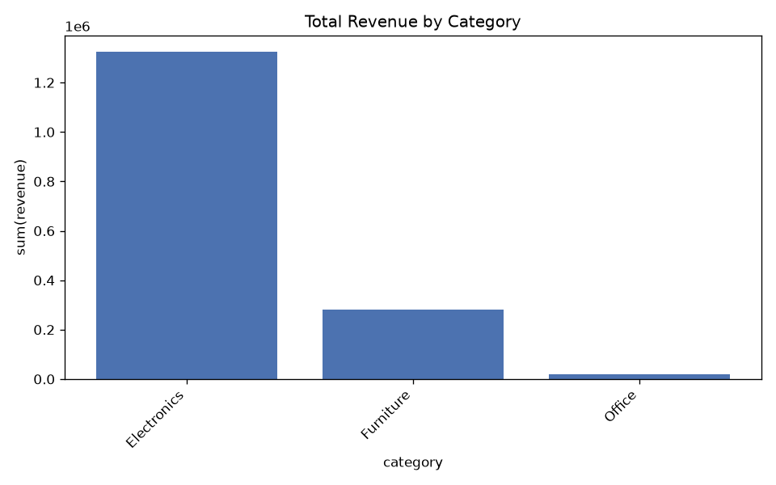

# Example session

A walkthrough against the bundled `data/sample_sales.csv` (600 rows of orders).
The `> tool(...)` lines are the MCP tool calls the agent made; the JSON figures
are the **actual** values the tools returned.

```text
you > Load data/sample_sales.csv as 'sales' and tell me what's in it.
  > load_dataset(name='sales', path='data/sample_sales.csv')
  > describe_dataset(name='sales')

assistant > Loaded 'sales': 600 rows x 10 columns. Columns include order_date,
region, category, product, customer_segment, units, unit_price, discount and
revenue. The discount column has 12 missing values; everything else is complete.
Categories are Electronics, Furniture and Office; regions are North/South/East/West.

you > Which region brings in the most revenue?
  > run_sql(query="SELECT region, ROUND(SUM(revenue),2) AS total_revenue,
            COUNT(*) AS orders FROM sales GROUP BY region ORDER BY total_revenue DESC")

assistant > North leads with $461,775 across 148 orders, just ahead of East
($450,650, 164 orders). South is $400,517 and West trails at $310,428. So North
earns the most despite having fewer orders than East — its average order value is
higher.

you > Is revenue driven more by how many units sell or by the price?
  > compute_correlations(name='sales')

assistant > Units is the dominant driver: units<->revenue correlates at 0.82,
while unit_price<->revenue is only 0.35. Discount has essentially no linear
relationship with revenue (-0.06). Volume matters far more than price here.

you > Any suspicious orders in the units column?
  > detect_outliers(name='sales', column='units', method='iqr')

assistant > Yes — 6 orders (1% of the data) sit above the IQR upper fence of 21.5
units. They're bulk purchases ranging from 83 to 190 units, mostly Corporate and
Small Business segments. The largest is ORD-10190: 190 monitors for $139,601.

you > Plot total revenue by category.
  > plot_chart(name='sales', chart_type='bar', x='category', y='revenue')

assistant > Saved a bar chart to charts/sales_bar.png. Electronics dominates at
~$1.33M, Furniture ~$0.28M, Office ~$0.02M.
```

The rendered chart from the last step:



---

## Text + semantic search

Against the bundled `data/reviews.txt` (20 product reviews, one per line). The
default offline backend is a lexical hashing vectoriser; installing the optional
`sentence-transformers` extra swaps in true dense semantic embeddings.

```text
you > Load data/reviews.txt as 'reviews' and give me corpus stats.
  > load_text_corpus(name='reviews', path='data/reviews.txt')
  > corpus_stats(name='reviews')

assistant > Loaded 20 reviews, 202 tokens total, vocabulary of 151 unique words,
averaging about 10 tokens per review (range 8-12).

you > Which reviews literally mention "battery"?
  > keyword_search(name='reviews', query='battery')

assistant > Only one review mentions "battery" literally: "The battery easily
lasts a full day of heavy use, very impressed." Note that other reviews discuss
the same idea using words like "charge" and "power cell" — keyword search misses
those.

you > Right — so search by meaning instead: "how long does the charge last".
  > semantic_search(name='reviews', query='how long does the charge last', top_k=3)

assistant > Ranking by embedding similarity, the closest reviews are about
battery/charge life — e.g. "Charge drains way too fast..." and the full-day
battery review. With the sentence-transformers backend installed, the "power
cell holds up remarkably well on long trips" review also surfaces even though it
shares no words with the query, which is the whole point of vector search.
```
